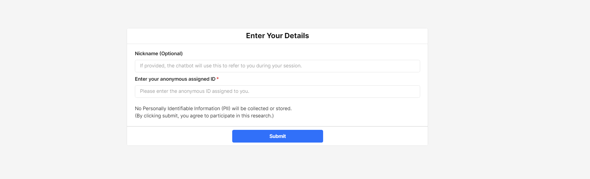
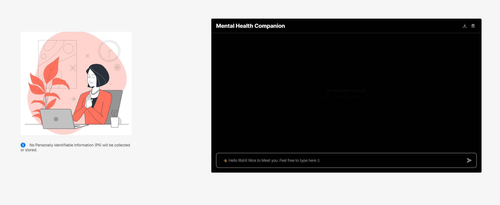
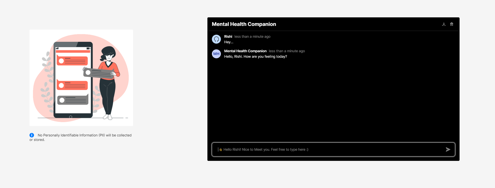
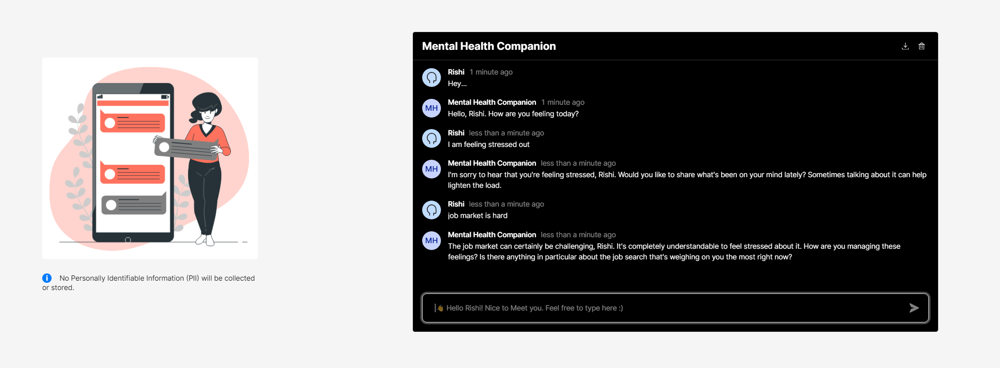

# 🧠 Mental Health AI Companion (Powered by AI & Retool)

> **"Early intervention in mental health can change lives. This AI chatbot provides a safe, anonymous, and accessible space for users to express their emotions and receive supportive guidance."**

## 🚀 Overview
The **Mental Health AI Companion** is an **AI-powered chatbot** designed to provide **empathetic, non-judgmental, and supportive conversations** for individuals seeking guidance on stress, anxiety, emotions, and overall mental well-being.

This chatbot integrates **Cognitive Behavioral Therapy (CBT), mindfulness techniques, and social support theory** to provide personalized and encouraging responses. By leveraging **GPT-4o** and a structured mental health framework, it acts as a **compassionate first point of contact** for individuals who might need someone to talk to.

---

## 🌱 **Why Early Intervention Matters**
- **Prevention Over Cure** – Addressing mental health concerns early can **prevent worsening conditions**.
- **Reducing Stigma** – Many individuals hesitate to seek professional help. AI provides a **safe, anonymous environment** to encourage conversations.
- **Emotional Regulation** – Users learn **coping strategies** before stress escalates into anxiety or depression.
- **Bridging the Gap** – AI cannot replace human therapists, but it **fills the accessibility gap** by offering 24/7 support.
- **Building Self-Awareness** – Conversational AI helps users **reflect on their emotions** and develop emotional intelligence.

---

## 🛠️ Features
✅ **AI-Powered Mental Health Support** – Provides conversational support based on **CBT, mindfulness, and therapeutic guidance**.  
✅ **Anonymous & Secure** – No personally identifiable information (PII) is collected.  
✅ **Empathetic Responses** – AI is trained to provide **compassionate, calming, and engaging** conversations.  
✅ **Personalized Experience** – The bot **remembers user context within a session** for deeper engagement.  
✅ **Accessible & Always Available** – Users can talk anytime, without barriers.  

---

## 🌇 Tech Stack
- **Retool** – Frontend and AI integration  
- **GPT-4o** – AI language model for intelligent responses  
- **PostgreSQL / MySQL** – For securely storing **anonymized chat history**  
- **JavaScript (JS)** – Custom Retool logic for database interactions  

---

## 🔧 How to Set Up & Use
### 1️⃣ Import Retool App
1. **Download `mental_health_ai_bot.json`** from the `/apps` folder.
2. Go to [Retool](https://retool.com/) and **create a new app**.
3. Click **Import JSON** and select `mental_health_ai_bot.json`.

### 2️⃣ Set Up the Database
- If using a database to store chat history, **import the schema**:
  ```sh
  psql -U your_user -d your_database -f db/schema.sql
  ```
  (Replace `your_user` and `your_database` with your actual credentials.)

### 3️⃣ Set Up OpenAI API (If Needed)
- If Retool does not have built-in AI, configure **OpenAI’s API**.

---

## 🔒 Privacy & Ethical Considerations
- **🚫 No PII Collected** – All user data is anonymized before storage.  
- **🔄 Responsible AI** – The chatbot follows **ethical AI guidelines**, ensuring **empathy, non-judgment, and safe guidance**.  
- **⚠️ Suicide Prevention Measures** – If a user expresses **severe distress**, the bot directs them to **988 (US Suicide Prevention Lifeline)** or other local resources.  

---

## 📂 Folder Structure
```
📂 apps/        # Exported Retool JSON files
📂 db/          # SQL schema for chat history
README.md       # Main documentation file
LICENSE         # Open-source license file
```

---

## 📸 Screenshots
### Chat Interface  





### Retool App Editor  
  

---

## 📝 License
This project is licensed under the **MIT License** – feel free to use and modify.

---

## 🤝 Contributing
Want to contribute? Fork the repo, create a new branch, and submit a **Pull Request (PR)**. Suggestions and improvements are welcome!

---

## 💎 Contact
Developed by **Rishi Ramesh**  
🔗 LinkedIn: [linkedin.com/in/rishiramesh](#)  
---

## ❤️ A Note on Mental Health
> "If you're struggling, please know that help is available. You're not alone, and your feelings are valid. Whether it's a conversation with this AI, a trusted friend, or a professional therapist—your mental health matters."

